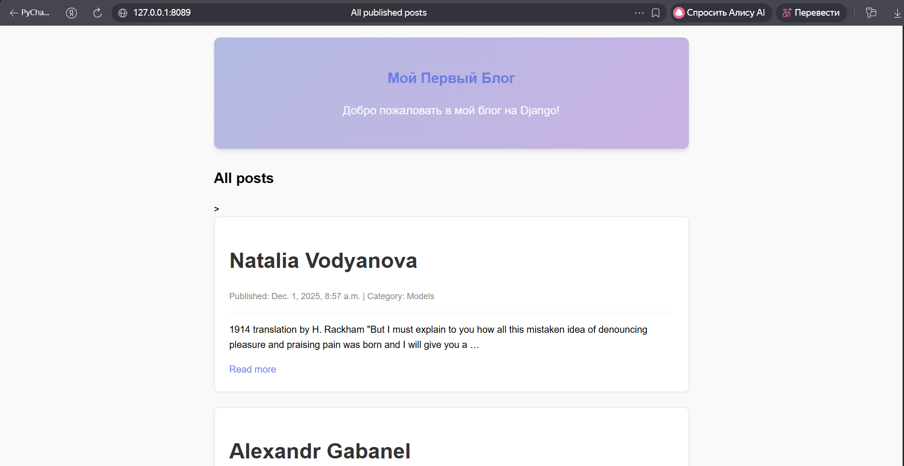
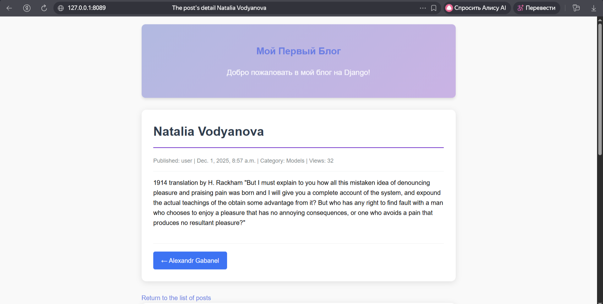
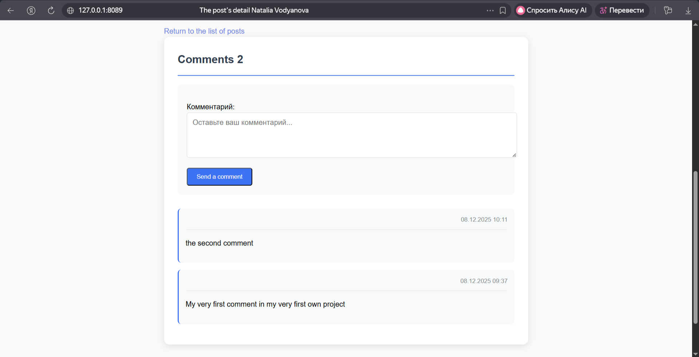
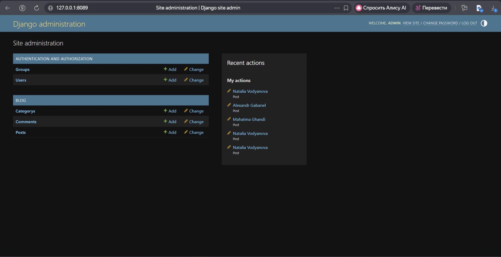

# Django Blog Project

Простой, но функциональный блог на Django для портфолио Python-разработчика.

## 🚀 Демо

Скриншоты работы проекта:






## ✨ Функциональные возможности

### ✅ Реализовано
- **Публикация постов** с категориями
- **Система комментариев** к постам
- **Счетчик просмотров** для каждого поста
- **Категории постов** с отдельными страницами
- **Кастомный менеджер** для работы только с опубликованными постами
- **Навигация** между соседними постами
- **Административная панель** Django для управления контентом
- **Адаптивный дизайн** (mobile-friendly)

### 🎯 Для бэкенд-разработки
- Кастомные Django менеджеры (`PublishedManager`)
- Оптимизированные запросы к БД с использованием `F()` для счетчика просмотров
- Правильная структура проекта (разделение на приложения)
- Использование Django Forms для комментариев
- Система статических файлов с отдельными CSS

## 🛠 Технологии

- **Backend:** Python 3.11+, Django 5.0
- **Database:** SQLite (разработка), готова к миграции на PostgreSQL
- **Frontend:** HTML5, CSS3 (чистый CSS без фреймворков)
- **ORM:** Django ORM с кастомными менеджерами
- **Аутентификация:** Django стандартная (с возможностью расширения)

## 📁 Структура проекта

- my_django_project/
├── blog/ # Основное приложение блога 
│ ├── models.py # Модели: Post, Category, Comment
│ ├── views.py # Представления (views)
│ ├── forms.py # Формы (комментарии)
│ ├── admin.py # Настройки админ-панели
│ ├── urls.py # URL-маршруты блога
│ ├── templates/blog/ # HTML шаблоны
│ └── static/blog/css/ # CSS стили
│
├── media/ # Загружаемые файлы (изображения постов)
├── static/ # Статические файлы
├── myblog/ # Настройки проекта
├── manage.py
├── requirements.txt # Зависимости проекта
├── README.md # Этот файл
└── .gitignore # Игнорируемые файлы

## 🚀 Установка и запуск

### 1. Клонирование репозитория
```bash
git clone https://github.com/Bukh-sun/first_django_project.git
cd my_django_project
```
### 2. Создание виртуального окружения
python -m venv venv
#### Активация для Windows:
venv\Scripts\activate
#### Активация для Mac/Linux:
source venv/bin/activate

### 3. Установка зависимостей

pip install -r requirements.txt

### 4. Настройка базы данных

python manage.py makemigrations
python manage.py migrate

### 5. Создание суперпользователя

python manage.py createsuperuser

### 6. Запуск сервера разработки

python manage.py runserver

### 7. Доступ к сайту

Основной сайт: http://127.0.0.1:8000/

Админ-панель: http://127.0.0.1:8000/admin/


## 👨‍💻 Tatiana Bukhaeva

## 🙏 Благодарности
Команда Django за отличный фреймворк

Stepik.org за качественные курсы

Сообщество Python-разработчиков


